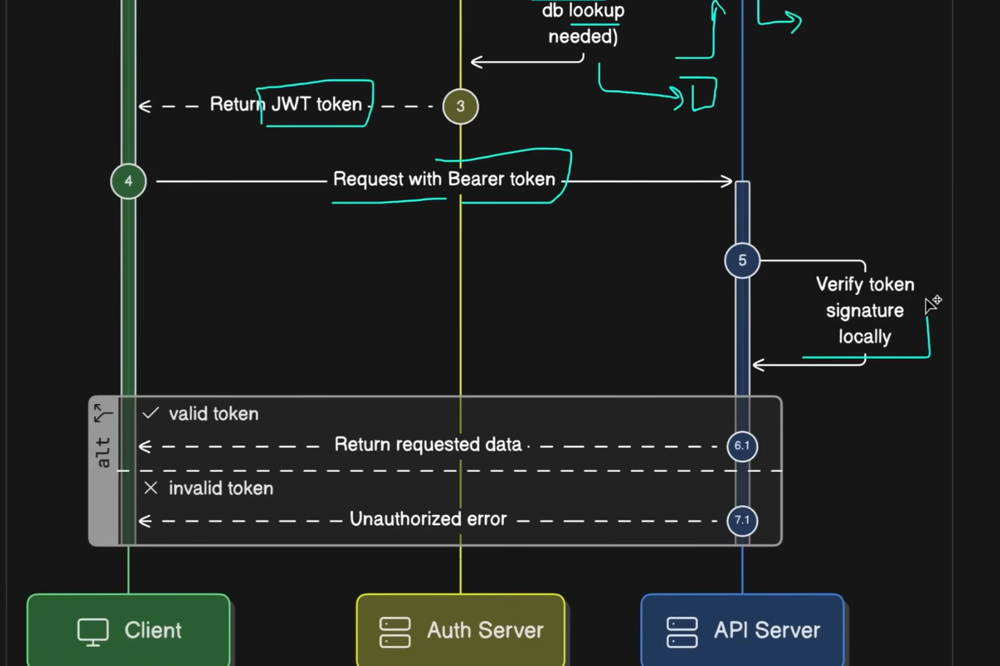
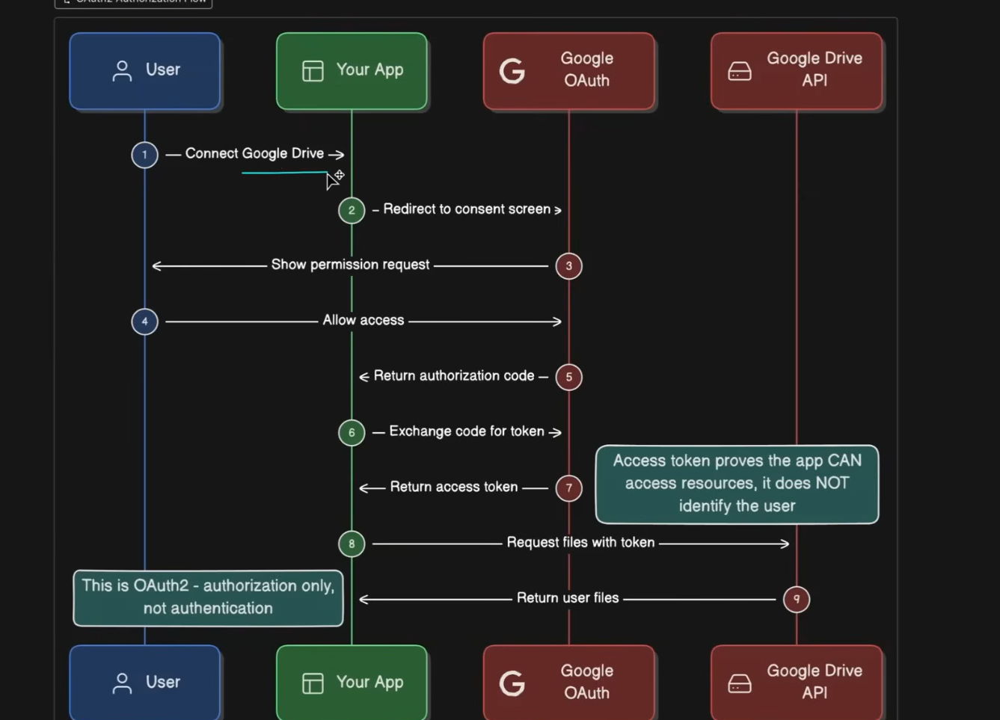
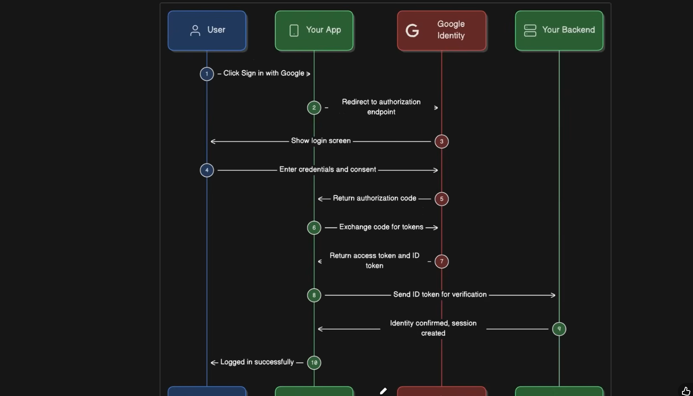

### Authentications

#### What is Authentication

providing access by verifying stored credetials

#### Basic Authentication Methods

##### Basic Authentication Flow
 client sends get rquest to server. Server sents an unauthorized response. In the upcoming request to the same exact resource, the get request from the client provides an authorization header, and in the server it checks the authorization header to see if valid or not. This method is rarely used now in production and is only secure with HTTPS and is rarely used in production

 ##### Digest Authenticaiton Flow

 Client sends a request for resource, server responds with first 401 unathorized and prompting for credentials, client then sends authorization information in a authorization header in next request but this time the information is hashed using MD5.

 This is slightly better due to hashing, but still outdated.

 ##### API Key Authenticaiton Flow

 client sends  request to the server which will include authorization header or X-API-Key, so the API key is within the request securely, the server then checks the database for valid API keys stored as a hash as well as the scope of access an API key provids an individual user and then retrieves those permissions.

 If the API key is valid then it will authorize the request and respond with the data or whatever the function is. If not it responds with 401 unauthorized. If the key is missing overall, then we return 400 Bad request since it is required in the request. 

 One bad thing bout API key is if it ever leaks, then anyone can use it which is bad.

 ##### Session-Based Authentication

 Use rlogs in with credentials, the server then creates a session in a session storage which is either in-memory, in Redis, or a dedicated database. We get the session ID and then we set the session cookie to the client. Any requests in the future from the client it requests with the session cookie. The server then looks up the session wherever sessions are stored and then if it is valid, e provide the user data back to the client with an authorized repsonse, if not found we send back unathorized response

 server must remmember sessions, which is harder to scale with distributed systems.

 #### Token-Based Authentication

 ##### JWT Bearer Token Authentication

 Client sends a token with each request, includes type of authentication as well as the token. Bearer token whoever has the token provides access, and the most common type of token is JWT. Server then validates credentials, this process is stateless and no memory is needed to validate credentials. Then server returns a JWT token to the 
 from thi spoint, clients can include this bearer token, this token in most cases is a JWT. When a request happens we veruft the token signature and if it is valid then we return requested data, otherwise we return unathorized 401.

 

 ##### Access and Refresh TOken Lifecycle

 Modern systems use access tokens and refresh tokens. Access tokens are used for API calls to the server, these tokens are short-lived. Refresh tokens are long-standing and are used to retrieve new access tokens. When users send login requests and sign in, they get both of these requests.
 
  Access tokens last from 15 minute to 1 hour while refresh tokens can last from a few days to a few weeks.

  So we generate both these tokens. Clients will use the access token to access the API. We store refresh tokens in httpOnly cookies and not localStorage. A user will stay logged in, once their access token expires, we will use the refresh token generated to request to the Auth server. the Auth server generates a new access token and then the client send sa request with the new access token to the API server.

  #### OAuth2 and OIDC

  ##### OAuth2

  Authorization framework and not an authentication. It basically answers what does the User have access to not necessarily are they a valid user. User connects google drive, the app then gets permission to access data. Once you allow access, google OAuth return authroization code to th app, the app exchanges code for the token and google auth returns an access token. The app then can request files with the token. After this the google drive API can return files.

  

  ##### OIDC Authentication Flow

  Open ID connection. When you click sign in with google, the app redirects to authorization endpoint from google. Once you enter the credentials and consent, the provider provides authorization code, the app then exchanges code for tokens and the provider returns an access token and ID

#### Single Sign On and Identity Protocols

